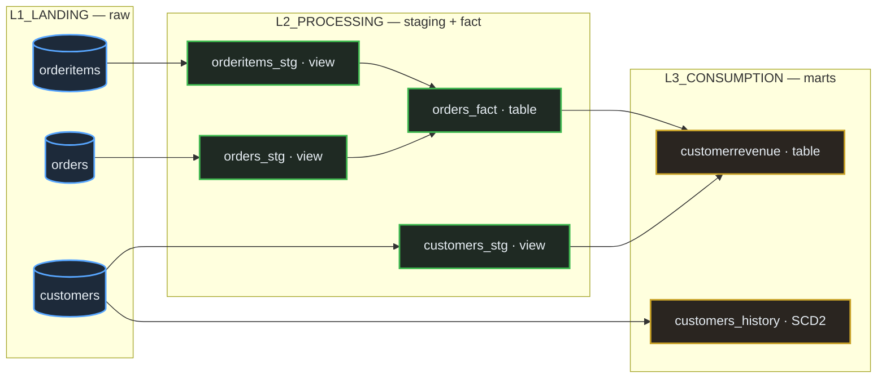

# DBT Shipping Project

A dbt project that builds a layered analytical model over a Snowflake source database (`SLEEKMART_OMS`) for an e-commerce / shipping order-management system. Implements a staging-fact-consumption pattern with sources, snapshots, generic and custom tests, macros, and seeds.

## Stack

- **Transformation**: dbt Core
- **Warehouse**: Snowflake
- **Source database**: `SLEEKMART_OMS`
- **Profile**: `f_dbt_proj` (configured in `~/.dbt/profiles.yml`)

## Schema layout

The project organises models across three logical schemas inside `SLEEKMART_OMS`:

| Schema | Layer | Purpose |
|---|---|---|
| `L1_LANDING` | Source | Raw tables: `customers`, `orders`, `orderitems`, `employees`, `sales_us`, `sales_uk` |
| `L2_PROCESSING` | Staging / fact | Cleaned staging models and the `orders_fact` aggregate |
| `L3_CONSUMPTION` | Mart | Final consumption-ready models and snapshots |

## Data flow



## Repository layout

```
DBT/
  f_dbt_proj/
    dbt_project.yml          # project config, model materialisations per layer
    models/
      customers_stg.sql      # view, L2 — concatenates customer name
      orders_stg.sql         # view, L2 — derives StatusDesc via CASE
      orderitems_stg.sql     # view, L2 — computes TotalPrice (qty * unit_price)
      orders_fact.sql        # table, L2 — order-grain fact joining orders_stg + orderitems_stg
      customerrevenue.sql    # table, L3 — customer-grain revenue rollup
      customerorders.sql     # ad-hoc consumption model
      storeperformance.sql   # store-level aggregate
      sales_us.sql, sales_uk.sql, jinja_code_tst.sql, macro_example_model.sql
      src_dum.yml            # source definitions, freshness thresholds, column tests
      gentest_config.yml     # generic test configurations
      oms_doc_blocks.md      # doc blocks referenced via {{ doc(...) }}
    snapshots/
      customers_history.sql  # timestamp-strategy SCD2 on customers
    tests/
      orders_fact_neg_revenue_check.sql   # singular: rows with Revenue < 0
      record_count_check.sql              # singular: row-count sanity
      generic/string_not_empty.sql        # generic: column-level test
    macros/
      generate_schema_name.sql            # override default schema-naming behaviour
      oms_comman.sql                      # to_celsius, generate_profit_model
    seeds/
      salestargets.csv       # store-level sales targets
    analyses/
      orders_stg_test.sql, StoreRevenue.sql, src_test.sql
```

## Setup

```bash
cd DBT/f_dbt_proj
python -m venv ../dbt_env && source ../dbt_env/bin/activate
pip install dbt-snowflake

# configure ~/.dbt/profiles.yml with a profile named `f_dbt_proj`
# pointing at SLEEKMART_OMS with the target schema you want models to default to
```

## Common commands

```bash
dbt debug                          # verify connection
dbt deps                           # install packages (if added)
dbt seed                           # load seeds/salestargets.csv into the warehouse
dbt snapshot                       # build/refresh customers_history SCD2
dbt run                            # build all models
dbt run --select orders_fact+      # build orders_fact and everything downstream
dbt test                           # run generic + singular tests
dbt build                          # seed + snapshot + run + test in dependency order
dbt docs generate && dbt docs serve
```

## Sources and freshness

Defined in `models/src_dum.yml`. The `landing` source binds dbt source names to physical tables:

| dbt source | Physical table |
|---|---|
| `landing.cust` | `L1_LANDING.customers` |
| `landing.ordr` | `L1_LANDING.orders` |
| `landing.ordritms` | `L1_LANDING.orderitems` |
| `landing.emp` | `L1_LANDING.employees` |

Freshness is monitored on `Updated_at`: warn after 1000 days, error after 10000. The `employees.address` column carries `not_null` and the project-defined `string_not_empty` generic test.

## Tests

- **Generic**: `string_not_empty` (in `tests/generic/`) — fails for rows where the trimmed column is `''`. Wire it up in any model's `.yml`.
- **Singular**:
  - `orders_fact_neg_revenue_check.sql` — returns OrderIDs where `Revenue < 0`.
  - `record_count_check.sql` — row-count sanity.

## Snapshots

`snapshots/customers_history.sql` uses dbt's `timestamp` strategy with `updated_at` as the change watermark and `CUSTOMERID` as the unique key. dbt manages `dbt_scd_id`, `dbt_updated_at`, `dbt_valid_from`, and `dbt_valid_to` automatically.

## Macros

- `generate_schema_name(custom_schema_name, node)` — overrides dbt's default `{{ target.schema }}_{{ custom_schema_name }}` concatenation so model-level `schema:` configs land verbatim (used so `orders_stg` resolves to `L2_PROCESSING`, not `DEV_L2_PROCESSING`).
- `to_celsius(fahrenheit_column, decimal_places)` — column transform used in sales models.
- `generate_profit_model(table_name)` — reusable revenue/cost/profit aggregation against `{{ source('training', table_name) }}`.

## Materialisation strategy

Set in `dbt_project.yml`:

| Model | Materialisation |
|---|---|
| `customers_stg`, `orders_stg`, `orderitems_stg` | view (default) |
| `orders_fact` | table |
| `customerrevenue` | table |

Staging stays as views (cheap, always reflects latest source); fact and consumption layers are physicalised as tables for query performance.
